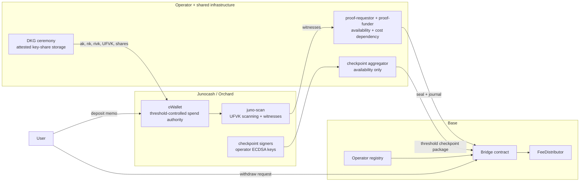

# intents-juno

Juno <-> Base bridge design centered on operator-quorum checkpoints, threshold-controlled Orchard custody, and public UFVK-based auditability.

Base does not verify Junocash consensus directly. It accepts EIP-712 checkpoints signed by a 3-of-5 operator quorum and verifies deposit and withdrawal proofs relative to those signed checkpoints.

## Trust Model At A Glance

## What Is Trusted

- A threshold quorum of registered operators must be honest about the Junocash checkpoint they sign.
- Threshold key shares must remain confidential and durable across enough operators to keep signing live.
- Shared proof infrastructure must remain available enough to keep mint and finalize flows moving.
- Governance and operational responders must pause or rotate the system if quorum equivocation, unexpected outflows, or deep reorgs are detected.

## What Is Not Trusted

- No single operator can spend from `oWallet` or unilaterally move funds on Base.
- The checkpoint aggregator and IPFS publication path are distribution conveniences, not trust anchors.
- Public auditors do not need secret material to monitor note flows because the UFVK is intended to be public.
- ZK proofs do not require Base to trust a relayer's word about a deposit or withdrawal, only the signed checkpoint root those proofs target.

## Trust Table

| Surface | Guarantee | Trusted assumption | Current evidence |
| --- | --- | --- | --- |
| Checkpoint quorum | Base verifies a typed checkpoint digest over height, block hash, Orchard root, chain id, and bridge address. | A `t`-of-`n` quorum does not sign a false checkpoint. | [`internal/checkpoint/checkpoint.go`](internal/checkpoint/checkpoint.go), [`cmd/checkpoint-signer/main.go`](cmd/checkpoint-signer/main.go), [`cmd/checkpoint-aggregator/main.go`](cmd/checkpoint-aggregator/main.go) |
| Threshold custody | No single operator share can authorize an Orchard spend from `oWallet`. | At least `t` shares stay both confidential and recoverable. | [`deploy/operators/dkg/README.md`](deploy/operators/dkg/README.md), [`deploy/operators/dkg/e2e/README.md`](deploy/operators/dkg/e2e/README.md) |
| Public auditability | Anyone with the UFVK can independently scan deposits, spends, and witnesses. | The published UFVK matches the active keyset. | [`deploy/operators/dkg/README.md`](deploy/operators/dkg/README.md), [`cmd/juno-witness-extract/main.go`](cmd/juno-witness-extract/main.go) |
| Proof boundary | Deposit and withdrawal proofs bind concrete events to a signed Orchard root. | The signed checkpoint root is honest; proof infrastructure remains available. | [`internal/proverinput/private_input.go`](internal/proverinput/private_input.go), [`cmd/proof-requestor/main.go`](cmd/proof-requestor/main.go), [`cmd/proof-funder/main.go`](cmd/proof-funder/main.go) |

## Read Next

- [Juno Intents Whitepaper](docs/Juno%20Intents%20Whitepaper.md)
