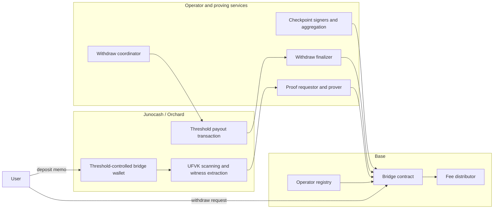
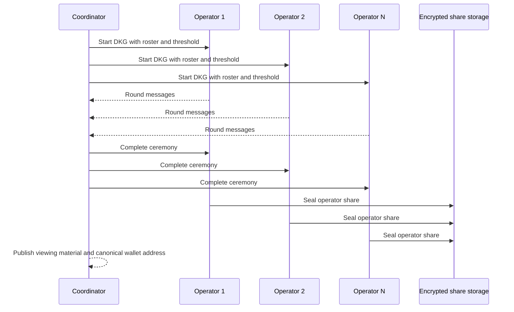

# Juno Intents Whitepaper

## Abstract

Juno Intents is a threshold-operated bridge for extending shielded Juno liquidity to Base without reducing custody to a single bridge signer.

The system combines threshold-controlled custody on Junocash, operator-signed checkpoints on Base, SP1-backed proof verification relative to those checkpoints, and published viewing material for external monitoring.

Base does not verify Junocash consensus directly, and the bridge therefore depends on an operator quorum not signing an invalid checkpoint.

Juno Intents defines a bridge for Orchard-based shielded assets in which custody, attestation, proving, and settlement are separated into explicit stages with defined trust boundaries, publicly inspectable data, and governance mechanisms for pause, rotation, and recovery.

## 1. Introduction

Shielded-asset bridging differs materially from bridging in transparent systems. In a conventional transparent bridge, deposits are visible on-chain, can be indexed directly, and can often be verified against an external chain with relatively straightforward logic. In an Orchard-based system, that is no longer true. The destination chain does not see an ordinary public deposit record, does not natively understand Junocash state transitions, and cannot cheaply determine whether a particular shielded note should authorize minting elsewhere.

The design problem is therefore broader than asset transfer across two chains. It is the movement of value out of a shielded state machine while preserving privacy, constraining custody risk, and still providing enough evidence for external audit. If those three goals are not addressed together, the result is typically either an opaque custodial bridge or a system that overstates trust minimization while depending on trusted operators.

Juno Intents addresses that setting directly. Base accepts typed checkpoints of Junocash state signed by a threshold of registered operators. Zero-knowledge proofs are then verified relative to those accepted checkpoints. Custody of the Junocash-side bridge wallet is itself threshold-controlled, and viewing material is published so that external observers can monitor bridge activity without receiving spend authority.

The claim of this paper is limited. Juno Intents combines threshold custody on Junocash, threshold checkpoint attestation on Base, and SP1-backed proof verification into a bridge model that is more constrained and auditable than a single-signer shielded bridge. Its trust boundary remains explicit. Base acts on signed Junocash state commitments rather than direct consensus verification.

## 2. Problem Setting And Design Objectives

Juno Intents addresses the problem of moving Juno between the shielded Junocash environment and an EVM chain without collapsing either privacy expectations or operational control into a single opaque actor.

This problem can be decomposed into four requirements that are often conflated.

First, custody on the Junocash side should not reduce to one hot wallet or one trusted signer. If one operator can spend from the bridge wallet alone, the bridge becomes custodial in the narrowest sense.

Second, Base-side minting and withdrawal finalization should depend on explicit Junocash state commitments rather than ad hoc relayer testimony. A relayer may carry data from one side to the other, but it should not be the authoritative source of whether a deposit or withdrawal is valid.

Third, bridge behavior should be externally auditable. Shielded systems are inherently harder for outsiders to monitor than transparent systems, so a bridge that moves shielded value must create public audit surfaces deliberately. Published viewing material, signed checkpoint packages, and proof-carrying settlement inputs serve that purpose.

Fourth, the system must admit governance and recovery. If operators equivocate, if custody material is suspected compromised, or if proving infrastructure degrades, the bridge should support pause, signer rotation, verifier updates, and renewed custody ceremonies.

These requirements explain why Juno Intents is threshold-operated rather than trustless, and operationally renewable rather than static. The design makes each trusted surface explicit and bounded.

## 3. System Overview

Juno Intents spans three layers.

On Junocash, a threshold-controlled bridge wallet receives shielded deposits and produces threshold-authorized payout transactions. This layer provides custody and note observation within the shielded pool.

Between the chains, operators and support services maintain checkpoint, witness, and proof infrastructure. This intermediate layer converts Junocash events into artifacts that Base can evaluate, including signed state commitments, witness bundles, and proof requests.

On Base, a bridge contract, operator registry, wrapped asset contract, and fee distribution logic accept signed checkpoints, verify proofs, mint or burn `wJUNO`, and track withdrawal state. This layer provides settlement and policy enforcement for minting and finalization.

The principal actors are:

| Actor | Role |
| --- | --- |
| User | Deposits on Junocash or requests withdrawal on Base |
| Operator quorum | Signs checkpoints and participates in threshold custody / payout authorization |
| Relayer / submitter | Submits mint and finalization transactions on Base |
| Proof services | Build guest inputs, request proofs, and return seals tied to specific journals |
| Base contracts | Verify checkpoints and proofs, escrow or burn `wJUNO`, and distribute fees |

Two settlement lanes define the protocol.

1. Junocash-to-Base: a shielded Juno deposit becomes a proof-backed mint of `wJUNO` on Base.
2. Base-to-Junocash: escrowed `wJUNO` becomes a threshold-authorized payout on Junocash and a proof-backed finalization on Base.

The important architectural property is stage separation. Custody, checkpoint attestation, proof generation, and contract settlement are different stages with different failure modes and different audit surfaces. That separation is one of the main reasons the bridge is more inspectable than a design in which one operator both controls funds and simply asserts what happened.



### 3.1 Juno->Base Lifecycle

The Juno-to-Base lane begins with the bridge wallet's public viewing surface. A deposit note is detected by scanning Orchard state under the published viewing key material, and the scanner extracts the note witness required for proof generation. The protocol does not accept a deposit because a relayer claims it exists. It accepts a deposit because the note can be recovered under the bridge viewing surface and tied to a particular Orchard root.

The routing payload is `DepositMemoV1`. That memo is not ornamental metadata. It is the domain-separation layer that binds the note to a specific Base chain and bridge contract before the deposit is treated as bridge-eligible. The memo parser checks its fixed width, checksum discipline, zero padding, chain binding, and bridge binding before any mint semantics are derived from it.

The deposit identifier is canonical:

```text
depositId = keccak256("deposit" || cmx || leafIndexBE32)
```

That identifier depends only on the note commitment and the Orchard leaf index. It is not chosen by the relayer, and it is not derived from an application-level memo string. Once a deposit witness is assembled, the relayer acquires a signed checkpoint package for the Orchard root that the proof will target, constructs the guest input, and requests a proof over the exact journal that Base will later verify.

The deposit guest proves three things in sequence. First, the note sits under the signed Orchard root. Second, the note decrypts under the bridge incoming viewing key. Third, the memo is valid for the intended Base chain and bridge contract and yields a concrete `(depositId, recipient, amount)` record. The result is an ABI-encoded journal that the contract later matches to the signed checkpoint and the submitted proof.

`mintBatch` then verifies the checkpoint quorum, verifies the proof, checks that the journal root and domain match the signed checkpoint, and finally applies bridge policy. Duplicate deposits are skipped. Invalid or below-minimum items are skipped. Accepted items mint net `wJUNO` to the recipient, route the operator fee share to the fee distributor, and route the relayer tip to the submitting caller. This behavior is deliberate. The protocol prefers partial forward progress under a correct checkpoint to whole-batch reversion when a mixed batch contains replayed or malformed items.

| Stage | What happens | What is checked |
| --- | --- | --- |
| Scan | Deposit note is observed | UFVK-scannable Orchard state and witness extraction |
| Memo parse | Deposit memo is parsed | Chain binding, bridge binding, CRC32, zero padding, magic |
| ID derivation | `depositId` is computed | `cmx` and `leafIndex` only |
| Proof | Guest proves inclusion and memo semantics | Merkle root, IVK decryption, memo domain |
| Base submission | `mintBatch` executes | Checkpoint quorum, proof, journal domain, minimums, replay protection |

### 3.2 Base->Juno Lifecycle

The Base-to-Juno lane begins with escrow, not with proof. `requestWithdraw` transfers `wJUNO` from the requester into the bridge contract, stores the raw Juno recipient bytes, snapshots `feeBps`, assigns an expiry window, and derives a canonical withdrawal identifier:

```text
withdrawalId = keccak256(
  "WJUNO_WITHDRAW_V1" ||
  chainId ||
  bridgeContract ||
  withdrawNonce ||
  requester ||
  amount ||
  keccak256(recipientUA)
)
```

That identifier binds the request to the current Base bridge contract, the requester's address, the amount, and the raw recipient bytes. It is not a free-form application nonce. The request stage therefore establishes three concrete objects on Base: escrowed `wJUNO`, a recorded recipient, and a settlement record with a specific expiry and fee snapshot.

The withdraw coordinator then claims pending requests, batches them deterministically, and constructs the Juno payout transaction under threshold control. Each payout output carries `WithdrawalMemoV1`, which binds the output to the Base chain, bridge contract, withdrawal identifier, and batch identifier. If a batch approaches expiry before it is safe to broadcast, operators can first authorize an expiry extension through a separate EIP-712 message family over sorted unique withdrawal IDs.

Once the threshold-signed Juno payout transaction is confirmed, the protocol records that fact on Base through `markWithdrawPaidBatch`. This is a distinct stage from finalization. The bridge records that a withdrawal has been paid or rendered irrevocable on the Juno side before it writes the final settlement state on Base.

Only after that stage does the withdraw finalizer request a proof and submit `finalizeWithdrawBatch`. The withdraw guest proves that the Juno output exists under the signed Orchard root, can be recovered under the bridge outgoing viewing key, matches the intended recipient, and yields the expected net amount. The Base contract then verifies the checkpoint quorum and the proof, checks the recipient hash against the stored raw recipient bytes, checks the fee math against the request-time snapshot, routes protocol fees and relayer tip from escrow, burns the net amount, and marks the withdrawal finalized.

The important point is that expiry is a finalization gate, not an alternate claim path. If a withdrawal reaches expiry without having been recorded paid, the finalizer skips it. If it has already been marked paid through the separate control message, finalization can still proceed after confirmation. The protocol therefore separates payout confirmation from final settlement instead of pretending they are the same event.

| Stage | What happens | What is checked |
| --- | --- | --- |
| Request | `requestWithdraw` escrows `wJUNO` | Amount minimum, recipient length, allowance |
| Snapshot | Expiry and fee state are fixed | `expiry`, `feeBps` |
| Batch | Coordinator builds payout transaction | Deterministic batch composition, threshold signing |
| Extension | Optional expiry extension | Sorted unique IDs, bounded new expiry |
| Paid marker | `markWithdrawPaidBatch` records confirmation | Sorted unique IDs, operator quorum |
| Finalize | `finalizeWithdrawBatch` settles Base | Proof, recipient hash, expiry or paid marker, fee math, escrow burn |

## 4. Trust Model

The bridge should be understood as threshold-operated, not trustless. That distinction matters.

Let $n$ be the size of the active operator set and let $t$ be the minimum number of operators required both to sign checkpoints and to authorize threshold spends. Let $O = \{1, 2, \dots, n\}$ be the operator set and let $S \subseteq O$ be the subset participating in a given signing event.

The bridge accepts a checkpoint only when the signer condition is satisfied:

$$
|S| \ge t
$$

and all participating signers are distinct active operators.

For a Junocash height $h$, define the checkpoint tuple

$$
C_h = (h, b_h, r_h, c, a)
$$

where $b_h$ is the block hash at height $h$, $r_h$ is the final Orchard root after that block, $c$ is the Base chain identifier, and $a$ is the bridge contract address.

The trust assumption is direct: if a malicious threshold quorum signs a false checkpoint, Base can accept a false view of Juno state. The whitepaper does not claim otherwise. What it claims instead is that this assumption is narrower, more inspectable, and more governable than the assumption of a single hot-wallet bridge operator.

### 4.1 Key Domain Separation

Juno Intents uses two distinct key domains, and the distinction is part of the security model.

The first domain is Juno custody. Those keys are born through distributed key generation and exist as threshold key-package artifacts. They authorize spend activity from the bridge wallet on Juno. No single operator should be able to reconstruct that authority or spend from the bridge wallet alone.

The second domain is Base operator signing. Those keys are secp256k1 ECDSA keys used to sign EIP-712 checkpoint digests, expiry-extension digests, and paid-marker digests on Base. In production, that signing path is designed around KMS-backed operator addresses, so the Base-side signing domain remains operationally distinct from the threshold custody surface even when the same operators participate in both.

The security implication is strict. Compromise of a Base signer key does not directly spend Juno custody shares. Compromise of a Juno custody share does not directly authorize a Base checkpoint signature. A threshold compromise in either domain is still serious, but the protocol does not collapse both risks into one secret.

The shared layer is operator identity. The same operator namespace links DKG participation, registry membership, checkpoint signing, and fee routing. That coupling is deliberate. It gives the system a single provenance layer for membership changes and incident response. It also means the domains are cryptographically separate but operationally linked.

| Domain | Authority | Typical artifact | Direct consequence of compromise |
| --- | --- | --- | --- |
| Juno custody | Threshold spend authority over the bridge wallet | Threshold key-package material and encrypted backups | Juno spend risk if threshold is reached |
| Base checkpoint signing | EIP-712 checkpoint and control messages | Operator ECDSA address and signer KMS lineage | False checkpoint or control-message risk if threshold is reached |

### 4.2 Checkpoint Domain And Frontier

Checkpointing is not merely a signature check. The bridge maintains a frontier on Base.

The checkpoint digest is EIP-712 bound to the Base chain and bridge contract. A checkpoint whose domain does not match the active Base deployment is rejected before any business logic is considered. Signatures must be sorted and unique. Distinct operator identity is not cosmetic; it is part of the meaning of threshold approval.

Checkpoint progression is also monotonic on Base. Once a checkpoint has been accepted, later submissions cannot move backward in height. A same-height submission with a different block hash or Orchard root is rejected as a conflict. This ensures that proofs attach to a single accepted frontier rather than to an arbitrary collection of signed state commitments.

The proof boundary is therefore narrow and explicit. The contract verifies a signed checkpoint root and then verifies a proof relative to that root. It does not infer Junocash consensus, and it does not infer root honesty from the proof alone.

| Rule | Meaning |
| --- | --- |
| Threshold signatures | A checkpoint requires at least `t` operator signatures |
| Sorted unique signers | Duplicate or unordered signer sets are rejected |
| Domain binding | Base chain ID and bridge contract are part of the digest |
| Monotonic height | Lower heights are rejected after a checkpoint has been accepted |
| Same-height conflict rejection | A same-height checkpoint must not change block hash or Orchard root |

## 5. Distributed Custody And Public Viewing

The most important design decision in Juno Intents is that the bridge wallet is never introduced as a single secret key. The wallet is born through distributed key generation.

For intuition, threshold generation can be described through a degree-$(t-1)$ polynomial

$$
f(x) = a_0 + a_1 x + a_2 x^2 + \cdots + a_{t-1}x^{t-1}.
$$

Each operator receives a share

$$
s_i = f(i), \qquad i \in O.
$$

The group validating key corresponds to the constant term:

$$
ak = [a_0]G.
$$

Any subset $S$ of size at least $t$ can contribute to a valid threshold signature. In the dealer-equivalent Shamir view, the constant term is reconstructed through Lagrange coefficients

$$
\lambda_i(S) = \prod_{j \in S, j \ne i}\frac{-j}{i-j},
\qquad
a_0 = \sum_{i \in S}\lambda_i(S)s_i.
$$

In the live system, normal signing does not reconstruct $a_0$ in one place. Instead, operators produce threshold signature shares that combine into a single Orchard-valid signature.

This distributed spend authority is paired with public viewing material. The bridge wallet publishes a Unified Full Viewing Key so that deposits, spends, and witnesses can be independently scanned. The deterministic derivations are

$$
nk = H_{\mathrm{base}}(d_{nk} \parallel ak_{\mathrm{bytes}})
$$

and

$$
rivk = H_{\mathrm{scalar}}(d_{rivk} \parallel ak_{\mathrm{bytes}})
$$

where $d_{nk}$ is the literal domain tag `WJUNO_NK_V1` and $d_{rivk}$ is the literal domain tag `WJUNO_RIVK_V1`.

The consequence is important. Auditability does not depend on trusting operator reports. Anyone with the published viewing material can observe the bridge wallet's note-level behavior. At the same time, viewing does not imply spending; the threshold spend authority remains distributed among operators.



## 6. Proof Architecture And Verification

The bridge uses proof to narrow the verification question, not to erase trust. Base does not verify Junocash consensus directly. Instead, it verifies a proof relative to a signed Orchard root and then applies contract policy on top of that proof.

### 6.1 Checkpoint Attestation

Checkpoint attestation is the root of the proof boundary. Operators sign the shared checkpoint tuple $C_h$ under an EIP-712 domain bound to the bridge name, version, Base chain ID, and bridge address. The same digest family is implemented by the off-chain signer and the contract, so there is no translation layer between signature production and signature verification.

That same signing family also governs Base-side operational control messages. Expiry extension and paid-marker authorization are not ad hoc admin actions; they are distinct EIP-712 message families over sorted unique withdrawal identifiers. The result is a single Base-side attestation model for checkpoint acceptance and post-request settlement control.

The meaning of checkpoint attestation is narrow. It says that a threshold quorum stands behind a particular `(height, blockHash, finalOrchardRoot)` tuple for a specific Base deployment. It does not say that the tuple is the only honest Junocash state. The proof system works downstream of that attestation boundary.

### 6.2 Deposit Guest: Witness, Memo Semantics, And Public Journal

The deposit guest consumes raw binary private input. Its header carries the Orchard root, Base chain identifier, bridge address, bridge incoming viewing key, and the number of witness items. Each witness item then carries the Orchard leaf index, the full authentication path, and the serialized Orchard action fields needed to reconstruct the note.

For each item, the guest recomputes the Orchard Merkle root from `leaf_index + auth_path`. If the recomputed root does not equal the checkpoint root, the item fails. If the root matches, the guest decrypts the note with the incoming viewing key. This is the first semantic boundary: the deposit is not merely included under the root; it is recoverable under the bridge viewing surface.

The guest then parses `DepositMemoV1`. That memo is a fixed 512-byte structure with checksum, zero padding, magic bytes, Base chain binding, and bridge binding. The guest enforces those fields before it derives mint semantics from the note. Once the memo is accepted, the guest produces the tuple `(depositId, recipient, amount)` and ABI-encodes the full `DepositJournal` expected by the Base contract.

Two details matter. First, `depositId` is canonical and derived from the note commitment and Orchard leaf index rather than from relayer-controlled metadata. Second, the memo contains fields such as `nonce` and `flags` that are validated during parsing but are not surfaced into the public journal. The journal carries only the fields that Base later uses to mint.

The deposit path therefore proves note inclusion, note decryption, memo validity, and journal construction under a specific signed Orchard root. It does not itself mint. It produces the public values that the contract later verifies.

### 6.3 Withdrawal Guest: Witness, Recipient Semantics, And Public Journal

The withdrawal guest follows the same pattern but with different semantics. Its binary private input carries the Orchard root, Base chain identifier, bridge address, bridge outgoing viewing key, and a list of withdraw witness items. Each item includes the withdrawal identifier, the raw Orchard recipient address, the Orchard leaf index, the authentication path, and the action fields required for output recovery.

The guest first recomputes the Orchard root from the leaf index and authentication path. It then attempts output recovery under the outgoing viewing key. This is the critical semantic difference from the deposit lane: the guest is proving not only that an output exists under the signed root, but that the bridge outgoing viewing surface can recover that output and bind it to a concrete recipient.

The guest next parses `WithdrawalMemoV1`. That memo binds the output to the Base chain, the bridge contract, the withdrawal identifier, and the batch identifier. The guest verifies the memo's checksum, zero padding, domain, and withdrawal identifier before it emits the final tuple `(withdrawalId, recipientUAHash, netAmount)`.

As with deposits, some memo fields are validated but not surfaced in the journal. `batchId` and `flags` participate in memo semantics, but the Base finalizer consumes only the withdrawal identifier, the recipient hash derived from the raw Orchard recipient bytes, and the net amount.

The output of the guest is therefore an ABI-encoded `WithdrawJournal` whose meaning is precise: a Juno output exists under the signed Orchard root, is recoverable under the bridge outgoing viewing surface, and corresponds to a particular Base withdrawal record and recipient.

### 6.4 Bridge Verification Path On Base

Base verification is intentionally split between proof and contract logic.

The guest proves witness validity relative to the signed Orchard root. The contract then decides whether that proved witness is admissible as a state transition on Base. For deposits, the contract still checks replay status, recipient sanity, minimum amount, and fee routing. For withdrawals, the contract still checks request existence, finalization status, expiry or paid-marker state, recipient hash equality, and fee math before it routes fees and burns escrow.

The on-chain proof verification surface is minimal. The contract calls an external `ISP1Verifier` interface of the form:

```text
verifyProof(programVKey, publicValues, proofBytes)
```

and binds each lane to a distinct program key through `depositImageId` and `withdrawImageId`. The bridge therefore verifies both the public journal and the program identity before it applies any contract state transition.

The proof is necessary, but it is not sufficient. Business policy stays in the contract.

| Layer | Proven by guest and prover | Checked by contract | Not proven |
| --- | --- | --- | --- |
| Checkpoint | Not applicable | Threshold signatures, domain, monotonic frontier | Honesty of the checkpoint root |
| Deposit | Inclusion, decryption, memo semantics, journal construction | Replay protection, minimums, fee routing | Consensus correctness |
| Withdrawal | Inclusion, output recovery, recipient binding, journal construction | Expiry gate, paid marker, finalization state, fee math, escrow burn | Juno payout liveness |

### 6.5 SP1/Succinct Proving And Submission

The proving path is a transport stack around an SP1 program, not a black-box oracle. The off-chain requestor builds the exact binary private input and the exact ABI journal expected by the contract. It then submits both to the proving layer as a versioned request carrying the program key, the journal, and the private input.

The proving adapter selects the deposit or withdrawal pipeline from the supplied program key, constructs the proving key, verifies that the resulting verifying key matches the requested image identifier, and requests an SP1 Groth16 proof. The current deployment path targets the SP1 network as the default proving backend, and the broader operational configuration is aligned to that network path.

One detail is especially important for the whitepaper. The proving layer does not invent the journal. The caller supplies the expected journal, the guest commits that journal as public values, and the adapter rejects any proof whose public values differ from the supplied journal. The seal that reaches Base is therefore tied to an exact public journal chosen before proof submission.

This architecture introduces an operational dependency as well as a cryptographic one. Proof requestors, prover adapters, and proof funders must remain available and sufficiently funded for the bridge to move. That dependency should be named directly. It does not change the meaning of the proof, but it does affect liveness.

The whitepaper should stay within what the repository supports. It is safe to describe the system as an SP1 Groth16 proving path with an external verifier interface on Base. It is not necessary, and would not be justified here, to claim more about verifier internals than the exposed interface and program-key binding.

### 6.6 What The Proof Does Not Prove

This boundary should remain explicit.

The proof does not prove that Base verifies Junocash consensus. It proves only that a guest saw a specific Orchard root and derived a specific journal from a valid witness under that root.

The proof does not prove that a checkpoint root is honest. It proves only that the witness and the journal are consistent with the checkpoint root that the operator quorum signed.

The proof does not provide replay protection by itself. Replay resistance comes from contract state such as used-deposit tracking, paid-marker state, finalized-withdraw tracking, and monotonic checkpoint acceptance.

The proof does not enforce minimums, expiry policy, recipient policy, or fee routing. Those are explicit contract rules.

## 7. Operator Revenue, Relayers, And Governance

The protocol has a real economic split between relayers and operators.

`relayerTipBps` rewards the caller that submits mint or finalization transactions on Base and bears gas and execution risk. The remaining protocol fee share accrues to operators through the fee distributor. That distinction matters because relayer work and quorum work are not the same function.

The operator registry stores `feeRecipient`, `weight`, `active`, and `threshold`, but `weight` is not checkpoint voting power. Checkpoint power remains one signature per active operator with a separate threshold parameter. Weight only affects fee distribution. This should be stated directly because weighted fee distribution is easy to misread as weighted quorum.

The protocol readily supports equal-weight deployments, but that is a deployment choice rather than a hard protocol law. Operators can be initialized as active with unit weight and their own fee recipient, and the threshold is set independently. The protocol can therefore evolve economic weighting without changing the signature semantics of checkpoint approval.

There is no slashing, staking, or bonding logic in the current system. Operator discipline comes from governance removal, threshold rotation, operational monitoring, and reputation rather than from an on-chain punishment market. That is a feature of the current institutional design and should be described honestly.

Governance on Base is also explicit. The governance surface can pause the bridge, assign a pause guardian, update verifier dependencies, rotate program image identifiers, adjust minimums and fees, and update operator membership through the registry. These powers are part of the trust model, not incidental implementation details.

## 8. Reliability And Operating Envelope

The choice of operator set size and threshold determines not only security against compromise, but also liveness under outage.

For a $3$-of-$5$ operator set, if the per-operator compromise probability is $p$, then the probability that at least three operators are compromised is

$$
P_{\mathrm{compromise}}(p) = \sum_{k=3}^{5}\binom{5}{k}p^k(1-p)^{5-k}.
$$

If the per-operator outage probability is $q$, then the probability that the bridge remains live for threshold signing is

$$
P_{\mathrm{live}}(q) = \sum_{k=3}^{5}\binom{5}{k}(1-q)^k q^{5-k}.
$$

Selected values are shown below.

| Per-operator probability | Quorum compromise $P_{\mathrm{compromise}}$ | Threshold liveness $P_{\mathrm{live}}$ |
| --- | --- | --- |
| `5%` | `0.1158%` | `99.8842%` |
| `10%` | `0.8560%` | `99.1440%` |
| `20%` | `5.7920%` | `94.2080%` |
| `30%` | `16.3080%` | `83.6920%` |


These curves are not claims about exact production behavior. Real systems exhibit correlated outages, correlated operator risk, and non-independent failure domains. Still, the curves are useful because they make the central operating trade-off explicit: a bridge that resists unilateral compromise also accepts that liveness depends on enough independent operators staying available.

## 9. Discussion Of Failure Modes

The most serious failure mode is a malicious checkpoint quorum. If enough operators sign a false checkpoint, Base can accept a false Junocash state commitment. This is the core reason the system is described as threshold-operated rather than trustless. The mitigations are not magical cryptographic escapes. They are public monitoring, governance response, rapid pausing, and key rotation.

A second failure mode is loss of threshold custody material. If enough operators lose recoverable share state, Juno payouts halt even if no theft occurs. This is an availability failure rather than a direct safety failure, but it remains economically important. The system therefore treats backup, restore, and share durability as first-class concerns rather than as auxiliary operations.

A third failure mode is partial compromise in one key domain. Compromise of a Base checkpoint signer does not directly spend Juno custody, and compromise of one Juno custody share does not directly authorize Base checkpoints. But either event narrows the remaining safety margin and should trigger investigation and, where appropriate, rotation.

A fourth failure mode is proof-path outage. Because Base-side minting and finalization depend on proof generation and proof submission, prolonged proving unavailability degrades the user experience and can stall settlement. This is an operational dependency rather than a custody failure, but a production system must treat it as seriously as a cryptographic concern.

Finally, deep Junocash reorgs remain a tail risk. The bridge acts on signed checkpoints and witnesses relative to those checkpoints. If reality later diverges from the signed checkpoint through an unexpected deep reorganization, the system requires pause and governance intervention. The design therefore assumes conservative confirmation policy and active monitoring of reorg anomalies.

## 10. Ceremony, Evidence, And Recoverability

The DKG ceremony is not only a key-generation event. It is the evidence boundary for custody.

What matters publicly is not raw secret material. What matters is the evidence that the threshold custody surface was created through a repeatable ceremony and can later be recovered in a controlled way. That evidence includes the ceremony identifier, roster summary, threshold, maximum signer count, completion record, published viewing surface, shielded wallet identity, and the hashes that bind the resulting key material to a single ceremony transcript.

Recoverability is equally important. A bridge that cannot be restored is not a durable system, even if it is cryptographically elegant. The protocol therefore treats backup packages, restore validation, and re-export lineage as part of the trust story rather than as operator-side housekeeping.

The Base-side signer path has its own evidence boundary. Signer provisioning, signer address lineage, recorded checkpoint commitments, and persisted checkpoint packages provide the audit layer around Base checkpoint authorization. They do not replace signature verification, but they make the operational provenance of that authorization legible.

The correct way to speak about evidence is therefore layered. Some evidence is public and citable. Some evidence is confidential and operator-local. Some evidence exists precisely to be escrowed and later used for controlled recovery. A high-trust bridge should identify those classes rather than collapsing them into a single undefined notion of operations.

## 11. Governance, Rotation, And Renewal

The bridge is designed to renew itself. Operator sets change, infrastructure evolves, and security assumptions degrade with time. Juno Intents therefore treats key rotation as a normal part of the system's life rather than as an exceptional event.

Any operator addition, operator removal, or suspected custody-share compromise should trigger a new distributed key generation process. The resulting keyset yields a new threshold spend surface, new encrypted share packages, and a refreshed canonical viewing surface for the bridge wallet.

Base governance must also be able to respond to non-custody incidents. A verifier dependency can need replacement. Program image identifiers can need rotation. Minimums and fee parameters can need adjustment. A pause guardian can need to halt settlement while operators investigate a checkpoint anomaly or a proving outage. These are real powers and should be understood as part of the governance model.

This approach is important economically as well as technically. A bridge that cannot rotate becomes brittle. A bridge that can rotate preserves institutional continuity while still responding to real incidents.

## 12. Conclusion

Juno Intents proposes a bridge architecture for shielded Juno liquidity that is candid about what is and is not proven. Threshold custody reduces single-party spend risk on the Junocash side. Signed checkpoints create an explicit Base-side acceptance boundary. Proofs bind concrete deposit and withdrawal events to that boundary. Published viewing material makes bridge activity more legible to external observers. Governance and rotation powers make incident response part of the system design rather than an off-book emergency measure.

The design remains threshold-operated rather than trustless. It narrows and clarifies the trust boundary relative to a conventional single-signer shielded bridge. In that more limited but practical sense, Juno Intents provides a more disciplined cryptographic and operational foundation for shielded-asset bridging.

## References

- Zcash Protocol Specification. https://zips.z.cash/protocol/protocol.pdf
- ZIP 224: Orchard Shielded Protocol. https://zips.z.cash/zip-0224
- ZIP 316: Unified Addresses. https://zips.z.cash/zip-0316
- ZIP 317: Fee calculation and conventional fee schedule for Zcash. https://zips.z.cash/zip-0317
- EIP-712: Typed structured data hashing and signing. https://eips.ethereum.org/EIPS/eip-712
- Succinct SP1 documentation. https://docs.succinct.xyz/docs/sp1/introduction
- Juno Intents repository implementation anchors, including `contracts/src/Bridge.sol`, `contracts/src/OperatorRegistry.sol`, `internal/checkpoint/checkpoint.go`, `internal/memo/memo.go`, `internal/proverinput/private_input.go`, `internal/depositrelayer/relayer.go`, `internal/withdrawcoordinator/coordinator.go`, `internal/withdrawfinalizer/finalizer.go`, and `internal/witnessextract/extractor.go` in the companion source tree.

## Appendix A. Canonical Encodings

This appendix captures the protocol encodings that matter for routing, domain separation, replay resistance, and settlement interpretation.

### A.1 `DepositMemoV1`

`DepositMemoV1` is a fixed 512-byte memo format. It is big-endian, CRC32-protected, zero-padded, and domain-separated by both Base chain ID and bridge address.

| Offset | Length | Field | Notes |
| --- | --- | --- | --- |
| `0x00` | `8` | `magic` | `WJUNO\x01\x00\x00` |
| `0x08` | `4` | `baseChainId` | Big-endian `u32` |
| `0x0c` | `20` | `bridgeAddr` | Domain binding |
| `0x20` | `20` | `baseRecipient` | Recipient on Base |
| `0x34` | `8` | `nonce` | Validated during memo parsing, not surfaced in the journal |
| `0x3c` | `4` | `flags` | Validated during memo parsing, not surfaced in the journal |
| `0x40` | `4` | `crc32` | IEEE CRC over bytes `0x00..0x3f` |
| `0x44` | `...` | `padding` | Must be zero |

### A.2 `WithdrawalMemoV1`

`WithdrawalMemoV1` is also a fixed 512-byte memo format with the same checksum and padding discipline.

| Offset | Length | Field | Notes |
| --- | --- | --- | --- |
| `0x00` | `8` | `magic` | `WJUNOWD\x01` |
| `0x08` | `4` | `baseChainId` | Big-endian `u32` |
| `0x0c` | `20` | `bridgeAddr` | Domain binding |
| `0x20` | `32` | `withdrawalId` | Must match the requested withdrawal |
| `0x40` | `32` | `batchId` | Used by the payout builder, not consumed by Base finalization |
| `0x60` | `4` | `flags` | Validated during memo parsing, not surfaced in the journal |
| `0x64` | `4` | `crc32` | IEEE CRC over bytes `0x00..0x63` |
| `0x68` | `...` | `padding` | Must be zero |

### A.3 Deposit And Withdrawal Identifiers

Canonical deposit identifier:

```text
depositId = keccak256("deposit" || cmx || leafIndexBE32)
```

Canonical withdrawal identifier:

```text
withdrawalId = keccak256(
  "WJUNO_WITHDRAW_V1" ||
  chainId ||
  bridgeContract ||
  withdrawNonce ||
  requester ||
  amount ||
  keccak256(recipientUA)
)
```

Canonical withdrawal batch identifier:

```text
withdrawalIdsHash = keccak256(concat(sorted withdrawal IDs))
batchId = keccak256("WJUNO_WITHDRAW_BATCH_V1" || withdrawalIdsHash)
```

### A.4 Checkpoint And Control-Message Families

Checkpoint tuple fields:

| Field | Meaning |
| --- | --- |
| `height` | Junocash height |
| `blockHash` | Block hash at that height |
| `finalOrchardRoot` | Signed Orchard root |
| `baseChainId` | Base chain binding |
| `bridgeContract` | Bridge address binding |

Base-side operational control-message families:

| Message family | Payload | Purpose |
| --- | --- | --- |
| `ExtendWithdrawExpiry` | `withdrawalIdsHash`, `newExpiry`, Base chain ID, bridge contract | Extend expiry before payout broadcast |
| `MarkWithdrawPaid` | `withdrawalIdsHash`, Base chain ID, bridge contract | Record Juno-side payment before finalization |

For both families:

```text
withdrawalIdsHash = keccak256(abi.encodePacked(sorted unique withdrawalIds))
```

### A.5 Guest Private Inputs

Production guests consume raw binary private input rather than a JSON envelope.

Deposit guest header:

```text
finalOrchardRoot[32] ||
baseChainIdLE[4] ||
bridgeContract[20] ||
owalletIVK[64] ||
nLE[4] ||
n * depositItem
```

Withdraw guest header:

```text
finalOrchardRoot[32] ||
baseChainIdLE[4] ||
bridgeContract[20] ||
owalletOVK[32] ||
nLE[4] ||
n * withdrawItem
```

Witness item layouts:

| Item | Layout |
| --- | --- |
| Deposit item | `leafIndexLE[4] || authPath[32*32] || nf[32] || rk[32] || cmx[32] || epk[32] || encCiphertext[580] || outCiphertext[80] || cvNet[32]` |
| Withdraw item | `withdrawalId[32] || recipientRawAddress[43] || leafIndexLE[4] || authPath[32*32] || nf[32] || rk[32] || cmx[32] || epk[32] || encCiphertext[580] || outCiphertext[80] || cvNet[32]` |

### A.6 Public Journals

Deposit public journal:

```text
DepositJournal(
  finalOrchardRoot,
  baseChainId,
  bridgeContract,
  items[]
)
```

Deposit journal item:

```text
(depositId, recipient, amount)
```

Withdraw public journal:

```text
WithdrawJournal(
  finalOrchardRoot,
  baseChainId,
  bridgeContract,
  items[]
)
```

Withdraw journal item:

```text
(withdrawalId, recipientUAHash, netAmount)
```

`recipientUAHash` is the Keccak-256 hash of the raw 43-byte Orchard recipient address, not of a display string.

### A.7 Hard Caps And Caveats

| Bound | Value | Notes |
| --- | --- | --- |
| Guest deposit items | `100` | Enforced by guest input encoding and guest code |
| Guest withdraw items | `100` | Enforced by guest input encoding and guest code |
| Bridge mint/finalize batch size | `200` | On-chain `mintBatch` and `finalizeWithdrawBatch` |
| Expiry and paid-marker batch size | `200` | On-chain `extendWithdrawExpiryBatch` and `markWithdrawPaidBatch` |

Field caveats:

- Deposit memo `nonce` and `flags` are validated during parsing, but they are not surfaced in the deposit journal.
- Withdrawal memo `batchId` and `flags` are validated during parsing, but they are not surfaced in the withdraw journal.
- The proof binds the witness to a signed Orchard root and a journal. It does not, by itself, prove that the signed root is the unique honest Junocash root.
