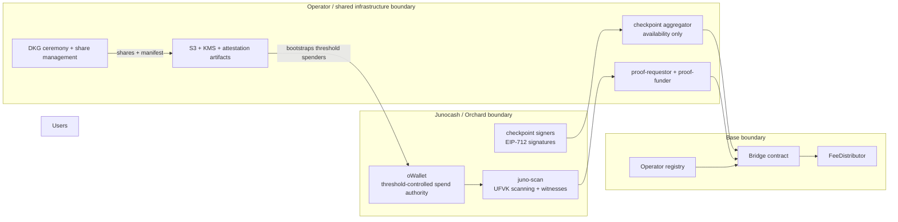
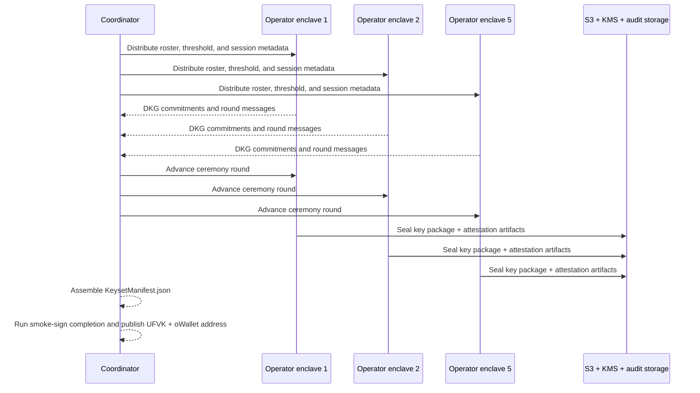
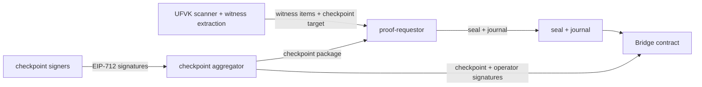
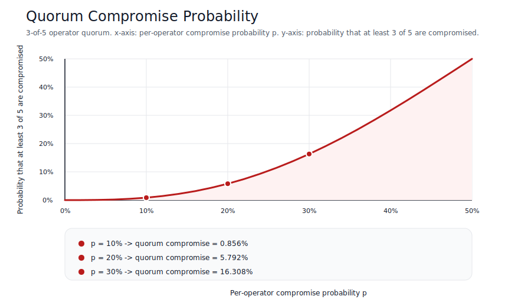
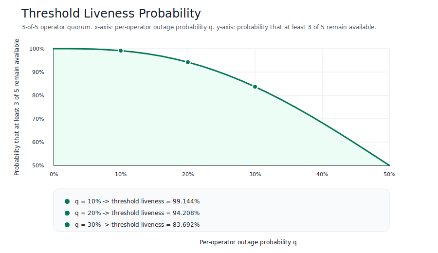

# DKG Trust Whitepaper

## 1. Thesis And Threat Model

| Lens | Notes |
| --- | --- |
| Guarantees | No single operator can spend from `oWallet`. Base only accepts deposit and withdrawal claims when they are tied to a signed Junocash checkpoint and a valid proof relative to that checkpoint. Public UFVK-based monitoring is intended to make note flows independently auditable. |
| Assumptions | Base does not verify Junocash consensus directly. A malicious checkpoint quorum can sign a false checkpoint. Availability depends on at least `t` operators, durable key-share storage, and proof infrastructure remaining live. |
| External dependencies | The ceremony and enclave control plane use complete upstream `dkg-ceremony` and `dkg-admin` capabilities, and threshold signing uses the complete upstream `juno-txsign` external spend-auth mode. |

The bridge is best understood as a high-transparency, threshold-operated system rather than a trustless light client. The design goal is not "remove trust entirely"; the design goal is to make trust explicit, minimize single-party custody, make the trusted set observable, and turn operational failures into detectable and governable events.

The trust statement is therefore:

$$
\text{Bridge safety} = \text{honest threshold checkpointing} + \text{threshold spend control} + \text{detectable operations}.
$$



## 2. Notation And Primitives

| Lens | Notes |
| --- | --- |
| Guarantees | The notation below names the exact objects that the bridge reasons about: operator set, checkpoint tuple, UFVK components, and threshold subsets. |
| Assumptions | The formulas describe the security model, not a promise that Base can independently derive Junocash consensus truth. |
| Operational evidence | The typed checkpoint object and digest logic are implemented in [`/internal/checkpoint/checkpoint.go`](../internal/checkpoint/checkpoint.go). Prover inputs are encoded in [`/internal/proverinput/private_input.go`](../internal/proverinput/private_input.go). |
| External dependencies | `KeysetManifest.json` generation and final operator key-package artifacts are part of the active ceremony and custody surface, even where their implementation source of truth lives outside this repository. |

| Symbol | Meaning |
| --- | --- |
| $n$ | Number of registered operators in the active keyset. |
| $t$ | Threshold required both for checkpoint quorum and Orchard threshold spend control. |
| $O = \{1, 2, \dots, n\}$ | Operator identifier set. |
| $S$ | A subset of operators participating in one signing event, with $S \subseteq O$. |
| $C_h$ | Checkpoint tuple for Junocash height $h$. |
| $ak$ | Group Orchard spend validating key produced by the threshold key ceremony. |
| $nk$ | Nullifier deriving key used in the Orchard full viewing key. |
| $rivk$ | Orchard commitment randomness key used in the full viewing key. |
| $\mathrm{UFVK}$ | Unified full viewing key published for public auditing and witness construction. |

The checkpoint tuple is:

$$
C_h = \left(h, \mathtt{blockHash}_h, \mathtt{finalOrchardRoot}_h, \mathtt{baseChainId}, \mathtt{bridgeContract}\right).
$$

The Bridge-side threshold condition is:

$$
|S| \ge t \quad \text{and all signer identities in } S \text{ are unique.}
$$

The checkpoint digest is an EIP-712 typed hash over the fields above. In implementation terms, the current code computes:

$$
\mathrm{Digest}(C_h) = \mathrm{Keccak256}(0x1901 \; || \; \mathrm{domainSeparator} \; || \; \mathrm{structHash}(C_h)).
$$

That matches the current implementation in [`/internal/checkpoint/checkpoint.go`](../internal/checkpoint/checkpoint.go), where the checkpoint type string is:

```text
Checkpoint(uint64 height,bytes32 blockHash,bytes32 finalOrchardRoot,uint256 baseChainId,address bridgeContract)
```

## 3. DKG Construction And Threshold Signing

| Lens | Notes |
| --- | --- |
| Guarantees | The custody design aims for day-1 distributed key generation so no machine ever holds the full Orchard spend secret scalar. The result is a threshold-controlled `ak` and per-operator key packages rather than a single hot key. |
| Assumptions | Threshold safety relies on correct ceremony roster and threshold parameters, correct share sealing, and correct operator identity assignment. If enough shares are lost or exposed, withdrawals halt or safety degrades. |
| External dependencies | The canonical ceremony engine is provided by complete upstream `dkg-ceremony` and `dkg-admin` tooling, and final transaction assembly uses the complete upstream `juno-txsign` external spend-auth mode. |

The design separates two key domains:

1. Operator ECDSA keys used for Base identity and checkpoint signing.
2. Threshold Orchard spend-authority shares used for `oWallet` custody.

For threshold reasoning, the DKG can be expressed in dealer-equivalent form with a degree-`t-1` polynomial:

$$
f(x) = a_0 + a_1 x + a_2 x^2 + \cdots + a_{t-1} x^{t-1}.
$$

Each operator receives one share:

$$
s_i = f(i), \quad i \in O.
$$

The group validating key corresponds to the constant coefficient:

$$
ak = [a_0]G.
$$

Any threshold subset `S` can interpolate the constant term in the abstract Shamir model with Lagrange coefficients:

$$
\lambda_i(S) = \prod_{\substack{j \in S \\ j \ne i}} \frac{0 - j}{i - j},
\qquad
a_0 = \sum_{i \in S} \lambda_i(S) s_i.
$$

The actual FROST signing path does not reconstruct $a_0$ during normal operation; it combines per-operator signing shares into one RedPallas signature. The interpolation equations above are included to make the threshold property explicit for reviewers.

The UFVK side is deterministic and public-auditable. The current architecture defines:

$$
nk = \mathrm{HToBase}(d_{nk} \parallel ak_{\mathrm{bytes}})
$$

$$
rivk = \mathrm{HToScalar}(d_{rivk} \parallel ak_{\mathrm{bytes}})
$$

where $d_{nk}$ is the literal domain tag `WJUNO_NK_V1`, and $d_{rivk}$ is the literal domain tag `WJUNO_RIVK_V1`.

The full viewing material is then constructed from `(ak, nk, rivk)` and published as a UFVK so deposits, spends, and witnesses can be independently checked without exposing spend authority.



## 4. Checkpoint Verification And Proof Boundary

| Lens | Notes |
| --- | --- |
| Guarantees | A deposit or withdrawal is only accepted on Base when a proof is evaluated relative to a checkpoint root that is itself signed by a threshold quorum. This binds each mint or finalize event to one explicit Orchard root. |
| Assumptions | The proof system proves consistency relative to the signed checkpoint root; it does not prove that the checkpoint root is honest Junocash consensus if the signing quorum is malicious. |
| Operational evidence | Typed checkpoint digests are implemented in [`/internal/checkpoint/checkpoint.go`](../internal/checkpoint/checkpoint.go). Proof private-input encoders are implemented in [`/internal/proverinput/private_input.go`](../internal/proverinput/private_input.go). Runtime entrypoints exist in [`/cmd/checkpoint-signer/main.go`](../cmd/checkpoint-signer/main.go), [`/cmd/checkpoint-aggregator/main.go`](../cmd/checkpoint-aggregator/main.go), [`/cmd/proof-requestor/main.go`](../cmd/proof-requestor/main.go), and [`/cmd/proof-funder/main.go`](../cmd/proof-funder/main.go). |
| External dependencies | Production proof market operations and guest-program rollout are active deployment components, even where not all source code lives in this repository. |

For one checkpoint $C_h$, the bridge trusts the following statement:

$$
\exists S \subseteq O \text{ such that } |S| \ge t \text{ and every } i \in S \text{ signed } \mathrm{Digest}(C_h).
$$

The proof layer then operates strictly relative to $\mathtt{finalOrchardRoot}_h$.

Deposit-side claim:

$$
\mathrm{DepositItem} \Rightarrow
\begin{cases}
\text{note commitment is in } \mathtt{finalOrchardRoot}_h \\
\text{note decrypts under the UFVK-derived viewing material} \\
\text{memo parses to the intended Base recipient and domain} \\
\text{amount and deposit identifier are derived deterministically}
\end{cases}
$$

Withdraw-side claim:

$$
\mathrm{WithdrawItem} \Rightarrow
\begin{cases}
\text{output note is in } \mathtt{finalOrchardRoot}_h \\
\text{memo binds the withdrawal identifier and batch identifier} \\
\text{recipient and net amount match the batch package}
\end{cases}
$$



### What The Proof Proves

- That a deposit or withdrawal witness is consistent with one signed Orchard root.
- That memo parsing and amount extraction follow one deterministic statement.
- That the Bridge can reject malformed or replayed items relative to the encoded journal.

### What The Proof Does Not Prove

- That Base has verified Junocash consensus directly.
- That the operator quorum is honest.
- That the shared proof requestor is economically or operationally available forever.

## 5. Reliability Model For A 3-Of-5 Operator Set

| Lens | Notes |
| --- | --- |
| Guarantees | The threshold configuration can be quantified rather than described qualitatively. Under simple independence assumptions, both compromise risk and liveness can be expressed directly as binomial sums. |
| Assumptions | The model assumes independent per-operator compromise probability `p` and independent per-operator outage probability `q`. Real systems exhibit correlation, so these curves are illustrative upper-level planning tools, not proofs of production reliability. |
| Model limitations | Better empirical models should eventually use measured operator uptime, correlated failure domains, and concrete incident-response timings rather than only binomial assumptions. |

For a `3`-of-`5` quorum, the probability that at least three operators are compromised, given per-operator compromise probability `p`, is:

$$
P_{\mathrm{compromise}}(p) = \sum_{k=3}^{5} \binom{5}{k} p^k (1-p)^{5-k}.
$$

The probability that the system remains live for threshold signing, given per-operator outage probability `q`, is:

$$
P_{\mathrm{live}}(q) = \sum_{k=3}^{5} \binom{5}{k} (1-q)^k q^{5-k}.
$$

Selected values:

| Per-operator probability | Quorum compromise $P_{\mathrm{compromise}}$ | Threshold liveness $P_{\mathrm{live}}$ |
| --- | --- | --- |
| `5%` | `0.1158%` | `99.8842%` |
| `10%` | `0.8560%` | `99.1440%` |
| `20%` | `5.7920%` | `94.2080%` |
| `30%` | `16.3080%` | `83.6920%` |





The charts above should be read as control-plane intuition:

- Lowering per-operator compromise probability matters non-linearly because the quorum condition compounds the benefit.
- The same threshold that reduces unilateral custody also creates a liveness floor: correlated outages across three operators halt signing.
- The system must therefore optimize both for confidentiality and for durable recoverability of enough shares.


## 6. Assumptions, Failure Modes, And Rotation

| Lens | Notes |
| --- | --- |
| Guarantees | The design has explicit pause and rotation points. Operator add, remove, or suspected share compromise leads to a new DKG rather than partial patching of custody state. |
| Assumptions | Governance and operators respond correctly to alarms, preserve the right artifacts, and execute rotation before a degraded state becomes unsafe. |
| Operational evidence | The repository already documents backup, restore, and handoff flows, and the current bridge design source material in this repo defines pause triggers and durable storage requirements. |
| External dependencies | Production key rotation, attestation verification, and full threshold-sign integration are active operational components, even where the source of truth lives outside this repository. |

Failure surface:

| Failure mode | What breaks | Detection path | Immediate control | Residual risk |
| --- | --- | --- | --- | --- |
| Malicious checkpoint quorum | Base can accept a false Junocash root. | Quorum equivocation checks, independent UFVK monitoring, operator telemetry. | Pause bridge, remove operators, rotate keyset. | This is the fundamental non-trustless risk. |
| Loss of `t` durable shares | Withdrawals halt because threshold signing cannot complete. | Restore drills, boot failures, missing recovery receipts. | Recover from backup artifacts or run a new DKG. | Funds remain safe but unavailable until recovery or rotation. |
| Share compromise below threshold | No immediate fund loss, but the security margin shrinks. | Attestation drift, KMS access anomalies, operator incident response. | Replace affected operators and run a new DKG. | If compromise spreads to threshold, custody fails. |
| Proof backend outage | Deposits and withdrawals stall on Base finality. | Proof backlog alarms, requestor balance alarms, service health checks. | Fail over requestor/funder path or switch prover backend when available. | User-facing delays and growing queues. |
| Deep Junocash reorg after checkpoint use | Proofs and minted or finalized state can become inconsistent with eventual chain truth. | Reorg depth monitoring from scanner and node telemetry. | Pause bridge and execute recovery plan. | No purely on-chain Base remedy exists once a malicious or stale checkpoint is used. |

Rotation rule:

1. Freeze new withdrawal execution if quorum honesty or share safety is in doubt.
2. Run a new DKG for any operator add, remove, or suspected share compromise.
3. Publish a new canonical keyset summary, including the replacement UFVK and `oWallet` address.
4. Update the on-chain operator and keyset configuration before resuming normal flow.

The bridge should be described publicly as "rotatable threshold custody with transparent assumptions," not as immutable trustlessness.
